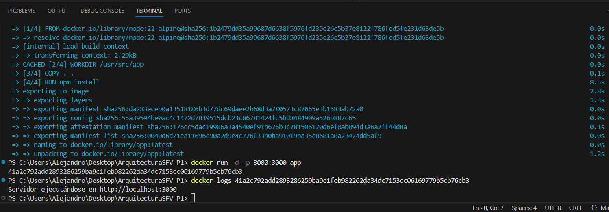

# ArquitecturaSFV-P1

# Evaluación Práctica - Ingeniería de Software V

## Información del Estudiante
- **Nombre** Alejandro Amu Garcia
- **Código:** A00395686
- **Fecha:** 6/8/25

## Resumen de la Solución
No se realizo implementacion de ninguna clase mas alla del docker

## Dockerfile
Este Dockerfile crea una imagen ligera de Node.js basada en Alpine Linux para ejecutase. Se establecio el directorio de trabajo, copia el código fuente al contenedor, instala las dependencias con npm install y configura la variable de entorno en el Puerto 3000 y expone este puerto para permitir conexiones externas y define como comando de inicio node app.js, que ejecuta la aplicación.

## Script de Automatización
No fue hecho

## Principios DevOps Aplicados
1. IAC

## Captura de Pantalla

## Mejoras Futuras
1. Se podria automatizar el monitoreo del contenedor para saber el estado del mismo
2. Se podrian añadir mas intrucciones al dockerfile dependiendo de lo que se quiera

## Instrucciones para Ejecutar
La aplicacion entregada solo cuenta con el dockerfile por lo cual se debera de hacer el build, el run y usar un comando
para comprobar y/o para ver dentro del contenedor.

comandos usados:

docker build . -t app

docker run -d -p 3000:3000 app 

curl http://localhost:3000 (comprobamos la conexion al docker y nos devuelve el contenido bruto de la pagina)

docker logs #"id del contenedor" (para ver los logs del contenedor y verificar el estado)
